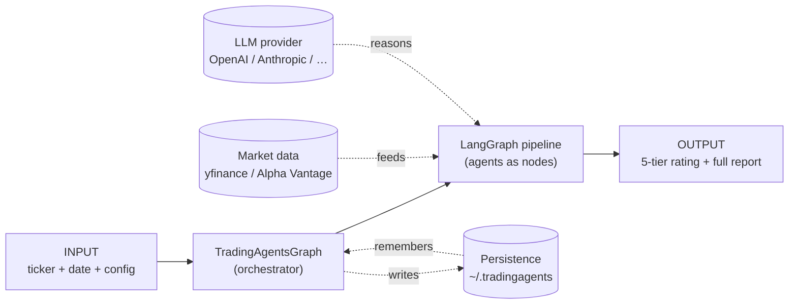
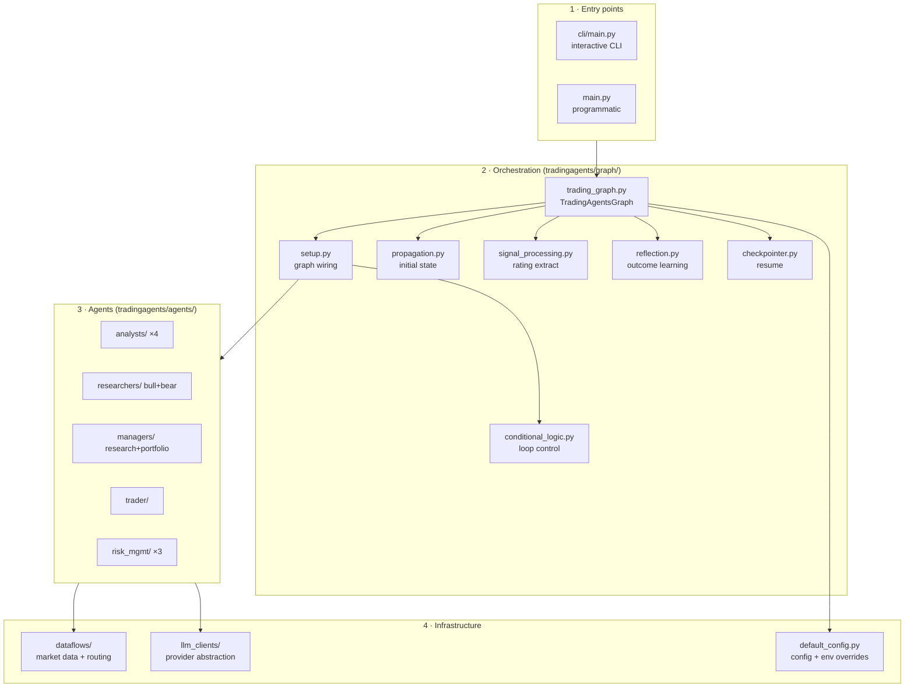
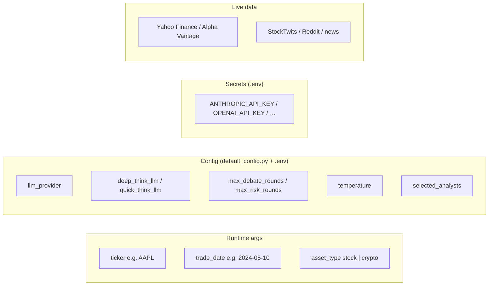
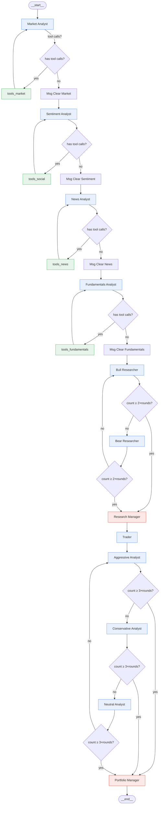
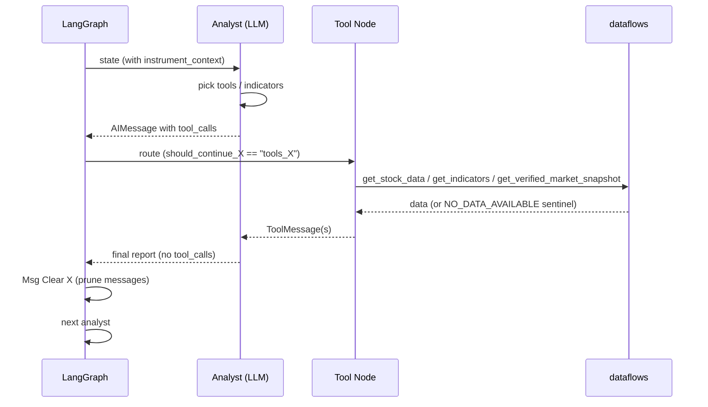
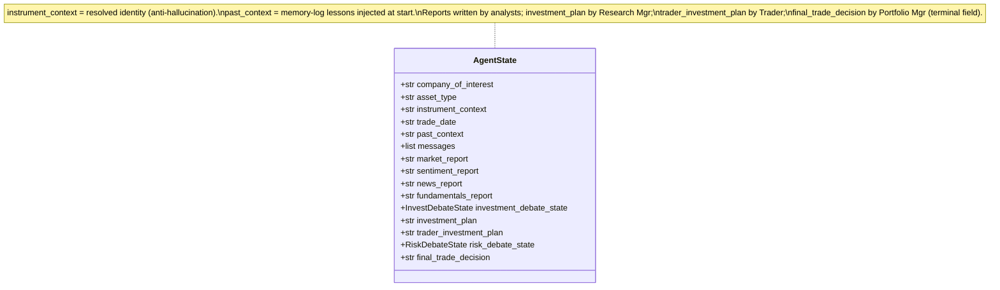
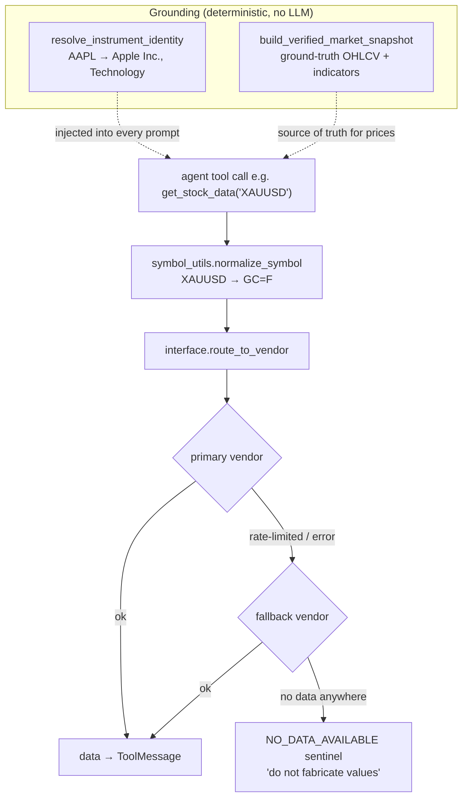
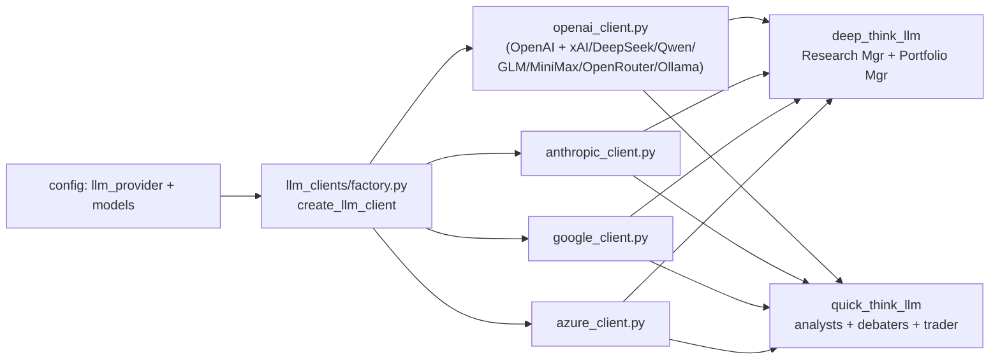
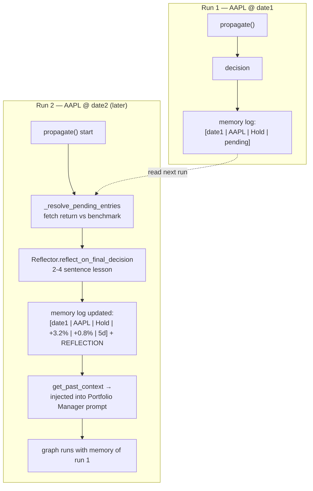
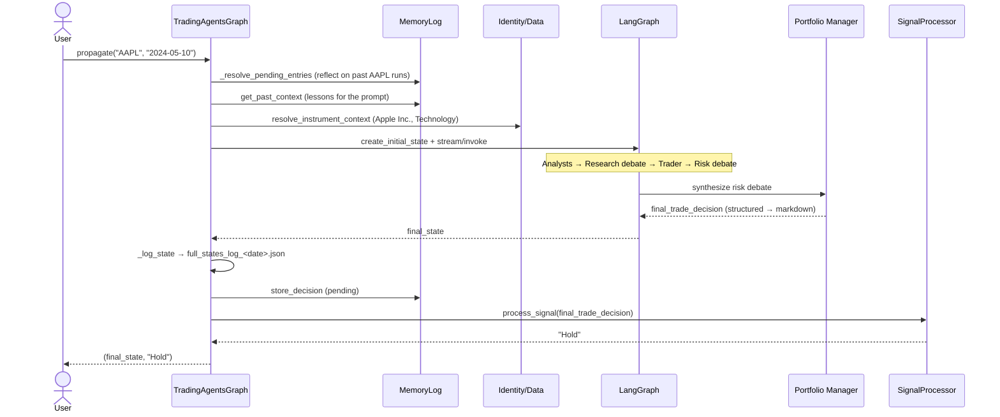

# TradingAgents — Architecture & End-to-End Flow

> A practical, diagram-first walkthrough of how a single call —
> `propagate("AAPL", "2024-05-10")` — turns a ticker + date into a
> **Buy / Overweight / Hold / Underweight / Sell** decision.

TradingAgents is a **multi-agent LLM framework** built on **LangGraph**. It models a
real trading desk: specialized agents analyze a security, debate it, propose a
trade, stress-test the risk, and a Portfolio Manager issues the final call.

This document is the source-of-truth map of the runtime. File references point at
the actual modules so you can jump from a box in a diagram to the code.

---

## 1. The 10,000-foot view



**One sentence:** the orchestrator builds a LangGraph state machine, streams the
shared state through a fixed sequence of LLM agents (each able to call
deterministic market-data tools), and the terminal node emits the decision —
which is also persisted for cross-run learning.

---

## 2. The four layers



| Layer | Responsibility | Key files |
|---|---|---|
| **Entry** | Start a run (interactive or code) | `cli/main.py`, `main.py` |
| **Orchestration** | Build graph, manage state, persist, learn | `graph/trading_graph.py`, `graph/setup.py` |
| **Agents** | The LLM-powered reasoning roles | `agents/analysts/…`, `agents/researchers/…`, etc. |
| **Infrastructure** | Data, LLM providers, config | `dataflows/`, `llm_clients/`, `default_config.py` |

---

## 3. Inputs and outputs

### Inputs



### Outputs

| Output | Where | Description |
|---|---|---|
| **5-tier rating** | return value of `propagate()` | `Buy / Overweight / Hold / Underweight / Sell` |
| **Full decision** | `final_trade_decision` in state | PM's complete markdown reasoning |
| **All agent reports** | full-state JSON | `~/.tradingagents/logs/<TICKER>/TradingAgentsStrategy_logs/full_states_log_<date>.json` |
| **Decision memory** | markdown log | `~/.tradingagents/memory/trading_memory.md` (tagged `pending` until outcome known) |
| **Checkpoints** *(opt-in)* | SQLite | `~/.tradingagents/cache/checkpoints/<TICKER>.db` |

---

## 4. The full pipeline (the heart of the system)

This is the compiled LangGraph — verified against the live graph topology.



**Legend:** blue = `quick_think_llm`, red = `deep_think_llm` (managers), green = deterministic tool nodes.

**Wiring lives in** `graph/setup.py`; **loop conditions in** `graph/conditional_logic.py`.

### Stage-by-stage

| Stage | Agents | Model | Output written to state |
|---|---|---|---|
| **1. Analysis** | Market, Sentiment, News, Fundamentals (sequential) | quick | `market_report`, `sentiment_report`, `news_report`, `fundamentals_report` |
| **2. Research debate** | Bull ↔ Bear | quick | `investment_debate_state` |
| **3. Research verdict** | Research Manager | **deep** | `investment_plan` |
| **4. Trade proposal** | Trader | quick | `trader_investment_plan` |
| **5. Risk debate** | Aggressive → Conservative → Neutral (cycle) | quick | `risk_debate_state` |
| **6. Final decision** | Portfolio Manager | **deep** | `final_trade_decision` |

**Loop termination (from `conditional_logic.py`):**
- Research debate ends when `count ≥ 2 × max_debate_rounds` (Bull + Bear = 2 speakers).
- Risk debate ends when `count ≥ 3 × max_risk_discuss_rounds` (3 speakers).
- With the defaults (`1`/`1`), that's one full round each.

---

## 5. The analyst tool loop (zoom-in)

Every analyst follows the identical ReAct-style pattern. The LLM decides which
tools to call; the tool node executes them; control returns to the LLM; when it
stops calling tools it writes its report and a "clear messages" node prunes the
tool chatter before the next analyst starts.



> **Note (fixed in this repo):** the tools the analyst is *bound to* must also be
> *registered in its tool node* (`trading_graph._create_tool_nodes`). The market
> analyst's `get_verified_market_snapshot` was bound but unregistered, so the call
> failed at runtime — now fixed, with a contract test in
> `tests/test_tool_node_registration.py`.

---

## 6. The shared state (the data contract)

All agents read and write one `AgentState` object (`agents/utils/agent_states.py`).
Each agent appends its slice; nothing is hidden in side channels.



---

## 7. Data layer — how numbers reach the agents

Tools never hand raw broker symbols to a vendor and never let the LLM invent
values. The pipeline normalizes symbols, resolves identity, routes to a vendor
with fallback, and grounds exact numbers in a verified snapshot.



| Concern | Mechanism | File |
|---|---|---|
| Broker → Yahoo symbols | `normalize_symbol` (forex `=X`, crypto `-USD`, futures aliases) | `dataflows/symbol_utils.py` |
| Vendor failover | `route_to_vendor` (yfinance ↔ Alpha Vantage) | `dataflows/interface.py` |
| "No data" vs "fabricate" | `NO_DATA_AVAILABLE` sentinel | `dataflows/interface.py` |
| Wrong-company hallucination | `resolve_instrument_identity` + `instrument_context` | `agents/utils/agent_utils.py` |
| Fabricated prices | `build_verified_market_snapshot` | `dataflows/market_data_validator.py` |

---

## 8. LLM layer — two models, many providers



- **`deep_think_llm`** — heavier reasoning, used by the two managers.
- **`quick_think_llm`** — cheaper/faster, used by analysts, researchers, trader, and risk debaters.
- Provider quirks (DeepSeek reasoning round-trip, MiniMax `reasoning_split`, capability-gated structured output) are isolated in client subclasses.

---

## 9. Persistence & the cross-run learning loop

TradingAgents gets smarter across runs. A decision is logged as `pending`; on the
**next run of the same ticker**, the realized return is fetched, a one-paragraph
reflection is generated, and recent lessons are injected into the Portfolio
Manager's prompt.



| Feature | Trigger | File |
|---|---|---|
| Decision log | always on | `agents/utils/memory.py` |
| Outcome + reflection | next same-ticker run | `graph/reflection.py`, `trading_graph._resolve_pending_entries` |
| Benchmark (alpha) | per-market suffix map (SPY, ^N225, …) | `trading_graph._resolve_benchmark` |
| Checkpoint resume | `--checkpoint` flag | `graph/checkpointer.py` |

---

## 10. Full request lifecycle (sequence)



---

## 11. Module map (where to look)

```
tradingagents/
├── graph/
│   ├── trading_graph.py      # orchestrator: propagate(), tool nodes, persistence, reflection
│   ├── setup.py              # builds & wires the LangGraph (nodes + edges)
│   ├── conditional_logic.py  # tool loops + debate termination
│   ├── propagation.py        # initial AgentState
│   ├── signal_processing.py  # extract 5-tier rating
│   ├── reflection.py         # outcome → lesson
│   └── checkpointer.py       # SQLite resume
├── agents/
│   ├── analysts/             # market, sentiment, news, fundamentals
│   ├── researchers/          # bull, bear
│   ├── managers/             # research_manager (deep), portfolio_manager (deep)
│   ├── trader/               # trader
│   ├── risk_mgmt/            # aggressive, conservative, neutral
│   └── utils/                # agent_states, agent_utils (tools), memory, schemas, structured
├── dataflows/                # symbol_utils, interface (routing), market_data_validator, vendors
├── llm_clients/              # factory + per-provider clients + capabilities
└── default_config.py         # config + TRADINGAGENTS_* env overrides
```

---

## 12. Run it yourself

```python
from tradingagents.graph.trading_graph import TradingAgentsGraph
from tradingagents.default_config import DEFAULT_CONFIG

config = DEFAULT_CONFIG.copy()
config["llm_provider"] = "anthropic"
config["deep_think_llm"] = "claude-sonnet-4-6"   # managers
config["quick_think_llm"] = "claude-haiku-4-5"   # analysts/debaters
config["max_debate_rounds"] = 1
config["max_risk_discuss_rounds"] = 1

ta = TradingAgentsGraph(
    selected_analysts=["market", "social", "news", "fundamentals"],
    debug=True,                # stream each agent's output live
    config=config,
)
final_state, decision = ta.propagate("AAPL", "2024-05-10")
print(decision)              # -> "Hold"  (the 5-tier rating)
```

Tip: start with `selected_analysts=["market"]` to watch a minimal run (≈3 active
nodes) before scaling to the full four.

> **Disclaimer:** TradingAgents is a research framework, not financial advice. It
> trades against a simulated exchange and its output varies run-to-run by design
> (see the README "Reproducibility" section).
